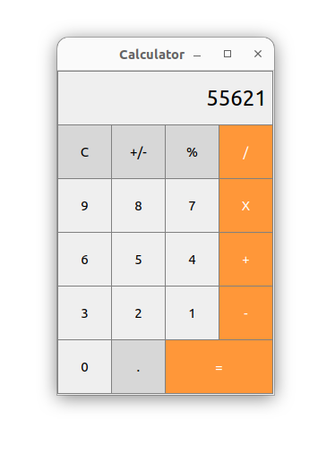

# Calculator App with Qt GUI


## Table of Contents
- [Description](#description)
- [Features](#features)
- [Prerequisites](#prerequisites)
- [Getting Started](#getting-started)
- [Usage](#usage)
- [Contributing](#contributing)
- [Screenshots](#screenshots)


## Description

This is a simple calculator application developed using C++ and the Qt framework. It provides a user-friendly graphical user interface for performing basic arithmetic operations such as addition, subtraction, multiplication, and division.

## Features

- User-friendly GUI for performing arithmetic operations.
- Supports addition, subtraction, multiplication, and division.
- Clear button for resetting the input and result fields.
- Error handling for division by zero and invalid input.
- Cross-platform compatibility (Windows, macOS, Linux).

## Prerequisites

Before you can run this application, ensure that you have the following prerequisites installed:

- Qt Creator (download and install from [Qt's official website](https://www.qt.io/download))
- CMake (for building the project)
- C++ compiler (e.g., GCC, Clang)

## Getting Started

1. Clone the repository:

   ```shell
   git clone https://github.com/Kalashyan-1/Calculator.git

2. Open Qt Creator.

3. Click on "Open Project" and navigate to the `Calculator` directory.

4. Select the CMakeLists.txt file and open it.

5. Qt Creator will configure the project.

## Usage

1. In Qt Creator, locate the project file in the "Projects" tab on the left sidebar.

2. Right-click on the project and select "Build" to compile the calculator application.

3. Once the build is successful, you can click the "Run" button to launch the calculator.

4. Use the buttons to input numbers and perform operations.

5. Click the "C" button to clear the input and result fields.

6. View the result of your calculation in the result field.

7. Error messages will be displayed if you perform invalid operations or divide by zero.

## Contributing

If you'd like to contribute to this project, please follow these steps:

1. Fork the repository.

2. Create a new branch for your feature or bug fix.

3. Make your changes and test them thoroughly.

4. Create a pull request with a clear description of your changes.


## Screenshots


